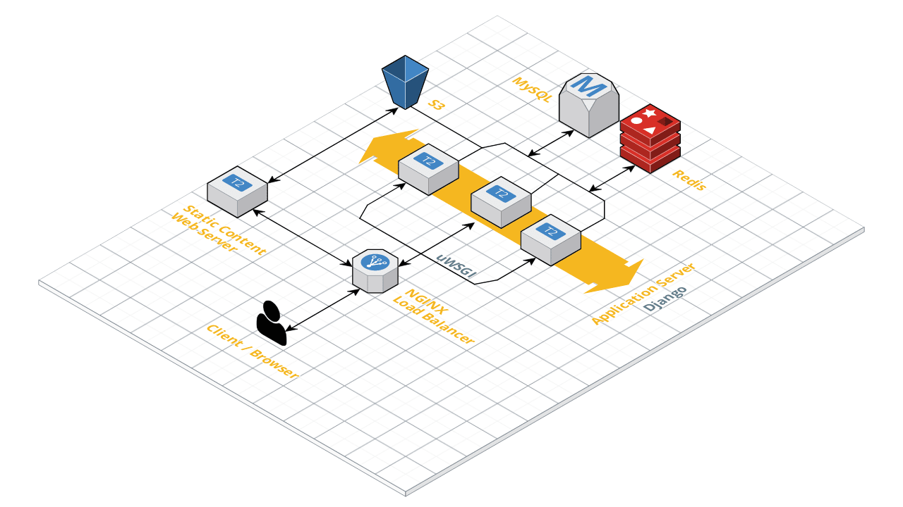

# Superbfresh - Online Grocery Marketplace

## Demo link
- [Superbfresh demo link](http://ec2-54-241-168-86.us-west-1.compute.amazonaws.com)

## Description
- Superbfresh is an online grocery marketplace based on B2C model. 

## Technology Stack
- Language: Python3
- Framework: Django
- Asynchronous Task Queue: Celery
- Database: Amazon RDS (MySQL)
- In-memory data store & cache: Amazon ElastiCache (Redis)
- Cloud storage: Amazon S3
- Email service: Amazon SES
- Payment + Webhooks: Stripe
- Search Engine: Amazon ElasticSearch
- Virtual Server: Amazon EC2
- Web server gateway: uwsgi
- Web server proxy: nginx

## Implemented functionalities
- [x] Backend function modules
    - [x] User module
        - [x] Register
        - [x] Login
        - [x] Logout
        - [x] Email activation (celery + Amazon SES)
        - [x] User center
        - [x] Address 
    - [x] Goods module
        - [x] Home page view (Generate static homepage through Celery, serve it from Static Content Web Server)
        - [x] Goods detail view 
        - [x] Goods list view 
        - [x] Signal processing (When admin add/delete a product, it should also be indexed/removed from the ElasticSearch documents)
    - [x] Cart module (Redis)
        - [x] Get cart item
        - [x] Add cart item
        - [x] Remove cart item 
        - [x] Update cart item 
    - [x] Order module 
        - [x] Confirm order (in place_order view )
        - [x] Commit order
        - [x] Pay order (through Stripe)
        - [x] Check order result & status 
        - [x] Comment ordered item
   -  [x] Webhooks module
        - [x] Check order result & status (Stripe's webhooks)        
   -  [x] Search module
        - [x] Search item based on item's title, description & type (Amazon ElasticSearch)
        - [x] Analyzer: html_strip
        - [x] Tokenizer: letter
        - [x] Filter: lowercase, stop, snowball
        - [x] Char_filter: html_strip
                      
## Software Architecture Diagram


## General Setup
- Install all dependency / packages ```pip3 install -r requirements.txt```
- See instruction below to setup each services
- Remember to set your own nginx & uwsgi configuration

## Setup EC2
- [Setup Amazon Ec2](https://aws.amazon.com/ec2/getting-started/) 

## Setup Database 
- [Setup mySQL with Amazon RDS](https://docs.aws.amazon.com/AmazonRDS/latest/UserGuide/CHAP_GettingStarted.html)

## Setup Redis
- [Setup Amazon ElastiCache Redis (Free Tier)](https://aws.amazon.com/getting-started/tutorials/setting-up-a-redis-cluster-with-amazon-elasticache/)
- [Docs - django-redis](https://niwinz.github.io/django-redis/latest/#_why_use_django_redis)    
- [Docs - redis-py](https://redis-py.readthedocs.io/en/latest/)
- Use cases:
    - For web optimization
        - Used to cache homepage html (or frequent visited html) so we can return these pages immediately to the client
    - As message broker for Celery, explained in Setup Celery section below.
- To check your redis's key-value store, use ```redis-cli -h <endpoint> -p <port>``` 
        
## Setup Celery
-  [Intro to Celery](https://docs.celeryproject.org/en/latest/getting-started/introduction.html)
- Used as a mechanism to distribute work across machines, for horizontal scaling purpose. 
- Used for sending email asynchronously
    1. Submitting task to Redis (broker) endpoint as a task queue
    2. Celery worker in remote server will get a task from Redis and perform the task
- Start a worker in remote server, remember to clone your function modules to the remote server 
- For development and testing
    - ```celery -A celery_tasks.tasks worker -l info```         
- For running celery worker in background
    - See [Run celery in background](https://docs.celeryproject.org/en/latest/userguide/daemonizing.html#generic-init-scripts)
        - Ex: ```celery -A celery_tasks.tasks worker --detach```

## Setup mail service
- [Setup Amazon SES](https://aws.amazon.com/ses/)
- NOTE:
    - Remember to request for increasing your SES Sending Limits and move out of Amazon SES sandbox to send email to others
    without pre-registered their email in SES console.

## Setup TinyMCE editor
- [Install django-tinymce](https://django-tinymce.readthedocs.io/en/latest/installation.html)

## Storing images in cloud
- [Setup Amazon S3](https://aws.amazon.com/s3/)
- [Install django-storages](https://django-storages.readthedocs.io/en/latest/backends/amazon-S3.html)

## Setup Stripe for payment & webhooks 
- [Install Stripe Python Library](https://github.com/stripe/stripe-python)
- [Stripe API docs](https://stripe.com/docs/api)
- [Setting Up Webhooks](https://stripe.com/docs/webhooks/setup)
- [Setup ngrok](https://dashboard.ngrok.com/get-started)
    - To make your local ec2 endpoint available for receiving events (in https scheme)
    - Fire up in background ```nohup ngrok http <port> &```
        - Ex: ```nohup ngrok http 80 &```        
    - To get the https_public_url, use ```curl http://127.0.0.1:4040/api/tunnels```
    - Pass this public_url as webhooks url with your api's url appended behind it.      
        - Ex: ```<ngrok_url>/<api>/<path>```
        
- To test Stripe payment
    - Credit card: ```4242 4242 4242 4242```
    - Expired Date: Set to future date
    - CSV: any number
        
## Setup AWS ElasticSearch
- [Intro to Amazon Elasticsearch Service](https://aws.amazon.com/elasticsearch-service/)
- [Install elasticsearch-py](https://github.com/elastic/elasticsearch-py)
- [Install elasticsearch-dsl-py](https://github.com/elastic/elasticsearch-dsl-py)
- In this application, you can search item through item's name, description and types.
    - Ex1 via item's name: grapes
    - Ex2 via item's description: sweet
    - Ex3 via item's types: fruit  
    
- NOTE
    1. Expose ```TYPE=HTTPS```, ```PROTOCOL=TCP```, ```PORT=443``` in your AWS Security Group (ex: es-sg)
    2. To index your datasets
        - Go to your python shell ```python manage.py shell```
        - Import the bulk function ```from apps.search.documents import bulk_indexing```
        - Start bulk indexing of specific document ```bulk_indexing()```
        - Start bulk deleting of specific document ```bulk_indexing()```
        

## Setup Application Load Balancer (using Nginx on EC2)
- [Setup nginx on EC2](https://docs.nginx.com/nginx/deployment-guides/amazon-web-services/ec2-instances-for-nginx/)
- Server static files in ```nginx```, before that make sure to run ```python manage.py collectstatic``` in application server
- Reload nginx ```nginx -s reload```
- Configure your nginx config depends on your software architecture diagram.

## Setup uWSGI settings & configuration (web server gateway interface)
- [Setup uWSGI](https://uwsgi-docs.readthedocs.io/en/latest/WSGIquickstart.html)
- Loading configuration files in background
    - ```uwsgi --ini <uwsgi.ini>```
- Stopping the uWSGI server 
    - ```uwsgi --stop <uwsgi.pid>```   

## Collect staticfiles 
- [Django collect staticfile](https://docs.djangoproject.com/en/2.2/ref/contrib/staticfiles/)
- We can use a remote server that serve static files, or we could use CDN, like Amazon CloudFront

## NOTE
- For integrating AWS services, please read the official docs provided above, 
and also make sure to configure your security groups (inbound / outbound) rules
to allowed their access to your EC2 instances.
    
## Miscellaneous
- [Kill nohup process](https://stackoverflow.com/questions/17385794/how-to-get-the-process-id-to-kill-a-nohup-process) 
- [AWS VPC configuration](https://treyperry.com/2015/06/22/ipv4-cidr-vpc-in-a-nutshell/)
    - [Another VPC configuration](https://www.whizlabs.com/blog/vpc-peering-basics/)    
    - NOTE: 
        - To connect two EC2 instances, set both Route Table's destination (IPv4 CIDR) equal to the another EC2's IPv4 CIDR, and set Target as the newly established VPC Peer connection
        - Set application inbound rules 
- [Tutorial on ec2 deployment with nginx and uWSGI](https://clintdunn.org/content/content/details/ec2-deployment-part-3/)
- [Check listening port](https://www.cyberciti.biz/faq/unix-linux-check-if-port-is-in-use-command/)
- The ```import-tags.sh``` file is used to import environment variables you set on your EC2 instances        
        

        
        
     


    
      
      

    